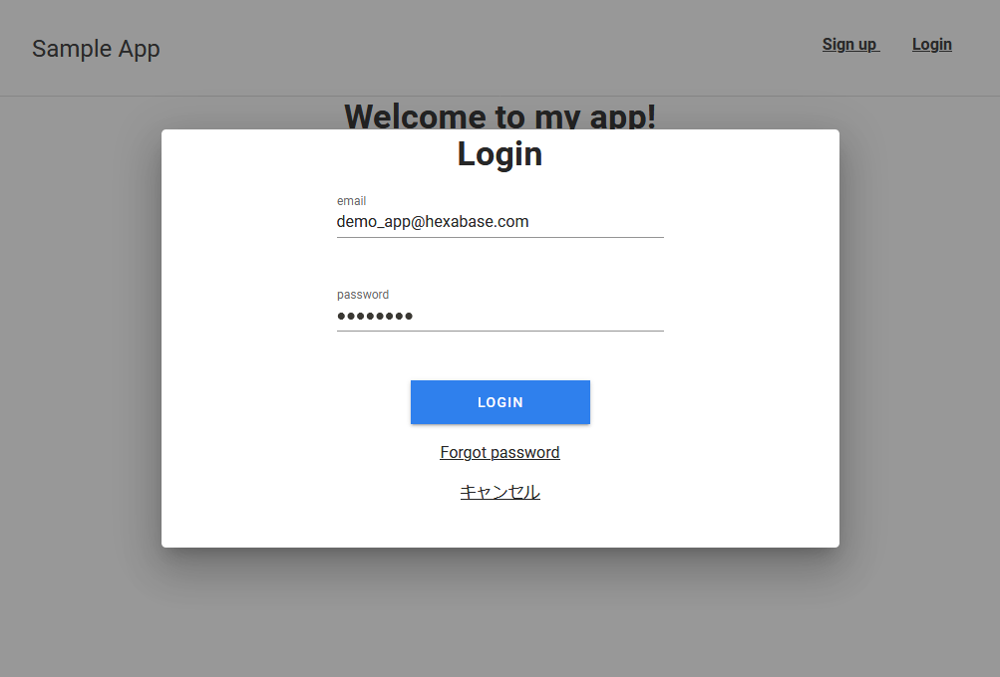

# login_basic_app

これは、Hexabaseのフロントエンドプログラムに利用できる、ログイン機能のサンプルプログラムです。Hexabaseへのログインと簡単なユーザー管理を提供します。



## Build Setup

```bash
# install dependencies
$ yarn install

# serve with hot reload at localhost:3000
$ yarn dev

# build for production and launch server
$ yarn build
$ yarn start

# generate static project
$ yarn generate
```

For detailed explanation on how things work, check out [Nuxt.js docs](https://nuxtjs.org).

.env で、APIのBASE_URLを指定してください。


## License

MIT License

Please see LICENSE file.

## 利用している主なライブラリ

- Vue.js
- Nuxt.js
- vuetify
- vee-validate

## 機能

- ログイン
- パスワード忘れ
- ワークスペース選択
- ユーザープロファイル編集
- パスワード変更
- ユーザーステータス管理(アクティブ / サスペンド)

## 制限事項

- SignUpリンクは動作していません
- あらかじめ、管理画面でユーザーを登録し、Usersデータベースに設定しておく必要があります。
- Usersデータベースにユーザーを重複登録しないでください。
- ユーザーステータス管理を利用するには、Adminロールを割り当ててください。

## To Do

- サインアップ / 新規ユーザー登録
- Usersデータベースで重複登録の禁止

## 関連ページ

- [サンプル一覧](https://b-eee.github.io/development_guide/docs/example/index)